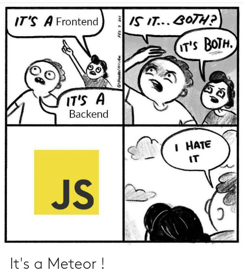

# js_world
Collection of descriptions of different things in this wonderful JavaScript world

(for all JavaScript heroes: Yeah, I know...it's basic...don't judge me 🥺)

  
(stolen from https://dev-clone.nuxtjs.app/anaflatlogic/774074)

# JavaScript, Motherf***er - [Do you speak it?](./Do%20you%20speak%20JS.md) 😳 [WAT?](https://www.destroyallsoftware.com/talks/wat)

### You may also like to [Know Your Enemy](https://github.com/develobrix/know-your-enemy-js)